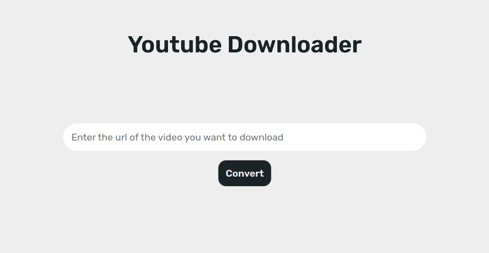

<h1 align="center">
    youtube-downloader
</h1>

> A website that permits you to download youtube videos
<div align="center">
    
</div>
youtube-downloader is a simple single page website running under nodejs using express that lets you download youtube videos to mp3 or mp4 format.

## Requirements
- [Node.js](https://nodejs.org/)

## Install
```
git clone https://github.com/TrAyZeN/youtube-downloader.git
cd youtube-downloader
npm install
```

## Usage
```
npm start
```

## License
MIT TrAyZeN
